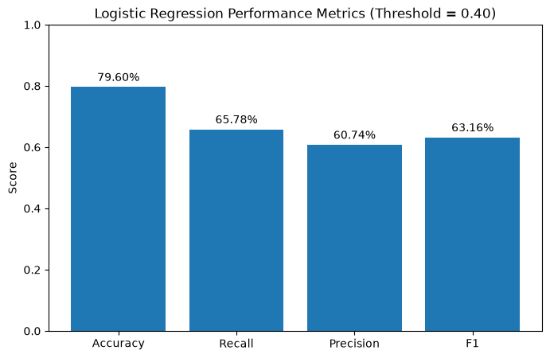
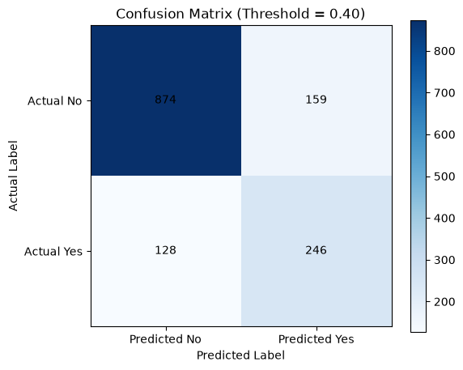
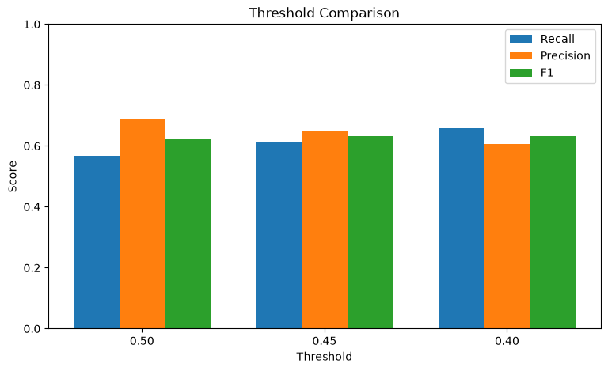

# Customer Churn Prediction
This project aims to predict whether a customer will churn or stay, so the company can take action to reduce customer churn
## Dataset
Our dataset is the [Telco Customer Churn dataset](https://github.com/IBM/telco-customer-churn-on-icp4d) from IBM.

We aim to predict whether a customer will churn or stay.
Our target variable is `Churn`, which has two classes: `Yes` and `No`.
## Data Exploration and Cleaning
- We explored the dataset and discovered that `TotalCharges` was stored as a string, but it should be a numeric value.
- We converted `TotalCharges` from string to numeric.
- We found 11 missing values and removed those rows.
- Finally, after cleaning, we have 7,032 customers.
## Feature Selection and Data Splitting
- We separated the features (X) from the target (y).
- We removed `customerID` because it is only an identifier.
- We split the data into 80% training and 20% testing.
- We used stratified splitting to keep the same Churn distribution in both sets
### Data Preprocessing

- Split the dataset into training and testing sets (80/20).
- Used stratified splitting to keep the churn distribution similar in both sets.
- Identified numerical and categorical features.
- Applied One-Hot Encoding to categorical features.
- Fitted the encoder only on the training data to avoid data leakage.
- Used the same encoder to transform the test data.
- Combined numerical and encoded features.
- Final training data shape: 5625 × 45.
- Final test data shape: 1407 × 45.
### Model Training

Three classification models were trained and evaluated:

- Logistic Regression
- Random Forest
- Gradient Boosting

The models were trained using the prepared training data and evaluated using the test data.

### Logistic Regression

Logistic Regression was used as the baseline model.

Initial results:

- Accuracy: 81.66%
- Recall: 56.68%
- Precision: 68.83%
- F1-score: 62.17%

Confusion Matrix:

- True Negatives: 937
- False Positives: 96
- False Negatives: 162
- True Positives: 212

### Random Forest

Random Forest was trained to compare its performance with Logistic Regression.

Results:

- Accuracy: 79.67%
- Recall: 52.67%
- Precision: 64.38%
- F1-score: 58.68%

Confusion Matrix:

- True Negatives: 935
- False Positives: 98
- False Negatives: 178
- True Positives: 196

### Gradient Boosting

Gradient Boosting was also trained and evaluated.

Results:

- Accuracy: 81.17%
- Recall: 56.15%
- Precision: 67.52%
- F1-score: 61.31%

Confusion Matrix:

- True Negatives: 932
- False Positives: 101
- False Negatives: 164
- True Positives: 210

### Model Comparison

Logistic Regression performed better overall than Random Forest and Gradient Boosting.

It achieved:

- Higher Accuracy
- Higher Recall
- Higher Precision
- Higher F1-score
- Fewer False Negatives

Because the main goal of this project is to identify customers who are likely to churn, Recall was considered an important metric.

### Cross-Validation

5-fold cross-validation was performed on the Logistic Regression model using the training data.

Recall scores:

- 53.85%
- 52.17%
- 57.19%
- 57.19%
- 48.49%

Average Recall:

- 53.78%

Average F1-score:

- 58.80%

The results showed that the model performance was relatively consistent across different training splits.

### Threshold Tuning

The default classification threshold of 0.50 was compared with 0.45 and 0.40.

Lowering the threshold makes the model more likely to predict Churn = Yes.

Threshold comparison:

#### Threshold = 0.50

- Accuracy: 81.66%
- Recall: 56.68%
- Precision: 68.83%
- F1-score: 62.17%
- False Negatives: 162
- False Positives: 96

#### Threshold = 0.45

- Accuracy: 81.02%
- Recall: 61.50%
- Precision: 65.16%
- F1-score: 63.27%
- False Negatives: 144
- False Positives: 123

#### Threshold = 0.40

- Accuracy: 79.60%
- Recall: 65.78%
- Precision: 60.74%
- F1-score: 63.16%
- False Negatives: 128
- False Positives: 159

A threshold of 0.40 was selected because the project prioritizes Recall and reducing False Negatives.

### Final Model

Final model:

- Logistic Regression
- Classification threshold: 0.40

Final performance:

- Accuracy: 79.60%
- Recall: 65.78%
- Precision: 60.74%
- F1-score: 63.16%
- False Negatives: 128
- False Positives: 159
- True Positives: 246
- True Negatives: 874

Lowering the threshold improved Recall from 56.68% to 65.78% and reduced False Negatives from 162 to 128.

### Visualizations

#### Model Performance

#### Confusion Matrix

#### Threshold Comparison

### Key Findings

- Logistic Regression performed better overall than Random Forest and Gradient Boosting.
- Accuracy alone was not enough to evaluate the model.
- Recall was important because missing churn customers can reduce the effectiveness of customer retention actions.
- Lowering the classification threshold increased Recall.
- A threshold of 0.40 reduced the number of missed churn customers.
- Increasing Recall also increased False Positives, showing the trade-off between Recall and Precision.

### Future Improvements

- Connect the trained model to the project website.
- Deploy the model through an API.
- Test class balancing techniques.
- Tune model hyperparameters.
- Test additional machine learning models.
- Perform feature importance analysis.
- Improve Recall while maintaining acceptable Precision.